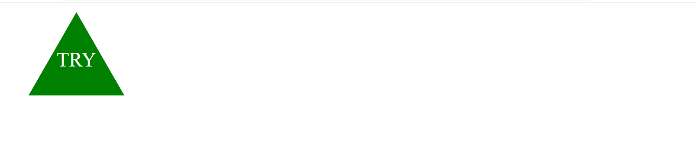

# 10 Object-oriented Programming: SVG Logo Maker

## Task

I have created a application for users to easily create a logo within seconds. To start this application, type the following command "node index.js". User will follow prompted questions, which will take the users input and customize their very own logo. This application allows the user to enter a color of the logo they want with the english version and hexadecimal number. User will enter a maxium of a 3 characters to represent their logo. The user will also be able to choose a shape and text color for the logo. It will take 5 seconds for their logo to be created and a prompt to guide the user to the file of their customized logo. This program can be used by anyone that may be in a rush, want to save money, and also they can have control over the process of creating their unique logo. Each shape has their individual file, which is then exported using module exports to the main index .js file. Each shape is constructed or made a new instance of from the constructor.js file, which is the blueprint for all shapes available in this program. As you can see, I have included test files to make sure the functionality of this application is running in good terms and what is expected is being delivered. I have created a SVG_constructor file, which holds the blueprint of the SVG logo that will be used to run the tests or used as an example to run the tests. There is also a template of what the expected line of code should look like when building the logo. Star the test by typing "npx jest" into the terminal , you will see that all tests have passed, if an error were to occur, it will show which test has failed and the reason for the failure. I have learned that spacing is very important, if their are any additional markups, indentation, or even spacing can throw an error. Test are a very important tool to understand, so that you can know for sure that the program is functioning to meet expectations.

## Walk-through Video: 
https://drive.google.com/file/d/1hdWf_A9rBNa8IFgxaRx7odIf_4Fj6K6Z/view

## Table of contents:
- [Task](#Task)
- [Walk-through Video](#walk-through-video)
- [Created Examples](#logo-examples)
- [User Story](#User-Story)
- [Mockup](#Mock-up)
- [Dependencies](#Dependencies)
- [Start Program](#start-the-application)
- [Tests](#Tests)
- [Resources](#helpful-svg-resources)
- [Contact](#Contact)


## Logo Examples:
  
      
    

 
### User-Story

```md
AS a freelance web developer
I WANT to generate a simple logo for my projects
SO THAT I don't have to pay a graphic designer
```

## Mock-Up


## Dependencies :

This applicatiion uses [Jest](https://www.npmjs.com/package/jest) for running the unit tests and [Inquirer](https://www.npmjs.com/package/inquirer/v/8.2.4) for collecting input from the user. 

## Start the Application:
Type this into your command line:

node index.js

## Tests
Typle this into your command line:

npx jest


## Helpful SVG Resources

* [Example SVG](https://static.fullstack-bootcamp.com/fullstack-ground/module-10/circle.svg)

* [Scalable Vector Graphics (SVG)](https://en.wikipedia.org/wiki/Scalable_Vector_Graphics)

* [SVG tutorial](https://developer.mozilla.org/en-US/docs/Web/SVG/Tutorial)

* [Basic SVG shapes](https://developer.mozilla.org/en-US/docs/Web/SVG/Tutorial/Basic_Shapes)

* [Text in SVG](https://developer.mozilla.org/en-US/docs/Web/SVG/Tutorial/Texts)

* [SVG VS Code extension](https://marketplace.visualstudio.com/items?itemName=jock.svg)

## Contact
Github: https://github.com/Ariesscode
Email: abigailtop95@yahoo.com

